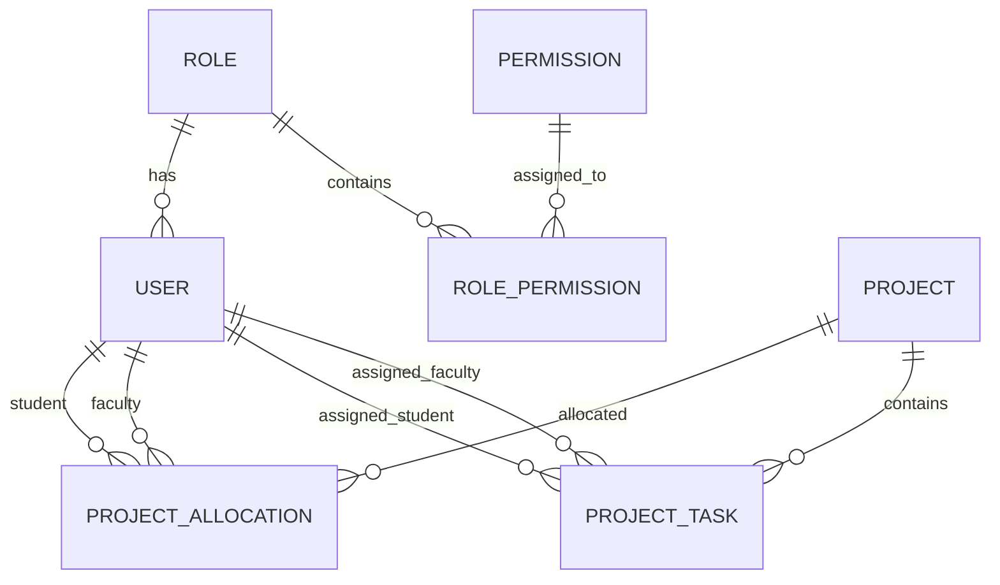

# Lab-1 Step-by-Step Guide

## Step 1. Understand the purpose of each table

### Model creation example (step-by-step)

This example shows how to create simple model files for `User` and `Role` in the project. Run these commands from the project root:

`Models/User.cs`:

```csharp
namespace StudentProjectManagementSystem.Models
{
    public class User
    {
        public long UserId { get; set; }

        public string FullName { get; set; }

        public string Email { get; set; }

        public string PasswordHash { get; set; }

        public string? MobileNumber { get; set; }

        public string? ProfilePicturePath { get; set; }

        public int RoleId { get; set; }

        public bool IsActive { get; set; }

        public bool IsDeleted { get; set; }

        public long? DeletedBy { get; set; }

        public DateTime? DeletedAt { get; set; }

        public DateTime CreatedAt { get; set; }

        public long? CreatedBy { get; set; }

        public DateTime? UpdatedAt { get; set; }

        public long? UpdatedBy { get; set; }

    }
}
```

`Models/Role.cs`:

```csharp
namespace StudentProjectManagementSystem.Models
{
    public class Role
    {
        public int RoleId { get; set; }

        public string RoleName { get; set; }

        public string? Description { get; set; }

    }
}
```

## Step 2. Navigation properties and relationships between tables

# Student Project Management System - ER Diagram



Navigation properties let EF Core connect entities in code the same way foreign keys connect tables in the database. In this project, every relationship has a foreign key property plus a navigation property so you can query related data cleanly.

### User relationships

`User` has four navigation properties:

| Navigation property | Relationship |
| --- | --- |
| `Role` | Each user belongs to one role through `RoleId` |
| `CreatedByUser` | Self-referencing link to the user who created the row |
| `UpdatedByUser` | Self-referencing link to the user who last updated the row |
| `DeletedByUser` | Self-referencing link to the user who deleted the row |

Add these in `Models/User.cs`:

```csharp
public int RoleId { get; set; }

public Role Role { get; set; }

public User? CreatedByUser { get; set; }

public User? UpdatedByUser { get; set; }

public User? DeletedByUser { get; set; }
```

### Role and permission relationships

`Role` and `Permission` are connected through the bridge entity `RolePermission`.

| Entity | Navigation property | Relationship |
| --- | --- | --- |
| `Role` | `Users` | One role can have many users |
| `Role` | `RolePermissions` | One role can have many role-permission rows |
| `Permission` | `RolePermissions` | One permission can have many role-permission rows |
| `RolePermission` | `Role` | Each bridge row belongs to one role |
| `RolePermission` | `Permission` | Each bridge row belongs to one permission |

Add these in `Models/Role.cs`:

```csharp
public ICollection<User> Users { get; set; }

public ICollection<RolePermission> RolePermissions { get; set; }
```

Add these in `Models/Permissions.cs`:

```csharp
public ICollection<RolePermission> RolePermissions { get; set; }
```

Add these in `Models/RolePermission.cs`:

```csharp
public Role Role { get; set; }

public Permission Permission { get; set; }
```

### Project relationships

`Project` connects to tasks, allocations, and audit users.

| Entity | Navigation property | Relationship |
| --- | --- | --- |
| `Project` | `Tasks` | One project can have many tasks |
| `Project` | `ProjectAllocations` | One project can have many allocations |
| `Project` | `CreatedByUser` | Self-referencing audit link |
| `Project` | `UpdatedByUser` | Self-referencing audit link |
| `Project` | `DeletedByUser` | Self-referencing audit link |

Add these in `Models/Project.cs`:

```csharp
public ICollection<ProjectAllocation> ProjectAllocations { get; set; }

public ICollection<ProjectTask> Tasks { get; set; }

public User? CreatedByUser { get; set; }

public User? UpdatedByUser { get; set; }

public User? DeletedByUser { get; set; }
```

### Install the necessary packages before Step 4

You can install these packages in Visual Studio using NuGet Package Manager:

1. Right-click the project in Solution Explorer.
2. Select **Manage NuGet Packages**.
3. Open the **Browse** tab.
4. Search for `Microsoft.EntityFrameworkCore` and install it.
5. Search for `Microsoft.EntityFrameworkCore.Design` and install it.
6. Search for `Microsoft.EntityFrameworkCore.SqlServer` and install it.
7. Search for `Microsoft.EntityFrameworkCore.Tools` and install it.

If you prefer the Package Manager Console, run:

```
Install-Package Microsoft.EntityFrameworkCore
Install-Package Microsoft.EntityFrameworkCore.Design
Install-Package Microsoft.EntityFrameworkCore.SqlServer
Install-Package Microsoft.EntityFrameworkCore.Tools
```

## Step 3. Create AppDbContext.cs

### What is `AppDbContext.cs`?

`AppDbContext.cs` is the main Entity Framework Core class that connects your C# models to the database. It tells EF Core which tables to create, how the tables are related, and how to save and read data.

### Why do we create it?

- It gives the application one central place to work with the database.
- It keeps all entity mappings in one file.
- It lets EF Core generate tables and relationships from your models.

### Where should it be created?

Create it inside the `Data` folder.

### Basic implementation of `AppDbContext.cs`

Add this file if it does not already exist:

```csharp
using Microsoft.EntityFrameworkCore;
using StudentProjectManagementSystem.Models;

namespace StudentProjectManagementSystem.Data
{
    public class AppDbContext : DbContext
    {
        public AppDbContext(DbContextOptions<AppDbContext> options)
            : base(options)
        {
        }

        public DbSet<User> Users { get; set; }

        public DbSet<Role> Roles { get; set; }

        public DbSet<Permission> Permissions { get; set; }

        public DbSet<RolePermission> RolePermissions { get; set; }

        public DbSet<Project> Projects { get; set; }

        public DbSet<ProjectAllocation> ProjectAllocations { get; set; }

        public DbSet<ProjectTask> Tasks { get; set; }

        protected override void OnModelCreating(ModelBuilder modelBuilder)
        {
            base.OnModelCreating(modelBuilder);
            // Step 4 continues here with the detailed entity configuration.
        }
    }
}
```

### What this code does

- `using Microsoft.EntityFrameworkCore;` imports EF Core features.
- `DbContext` makes the class act like the database bridge.
- `DbContextOptions<AppDbContext>` passes the database configuration into the class.
- `DbSet<T>` properties represent the tables in the database.
- `OnModelCreating` is where you configure keys, relationships, and rules in the next step.

## Step 4. Configure entities in AppDbContext.cs

Add the `OnModelCreating` method inside your `AppDbContext` class. This configures the tables, primary keys, relationships, and constraints.

```csharp
        protected override void OnModelCreating(ModelBuilder modelBuilder)
        {
            base.OnModelCreating(modelBuilder);

            // =========================================================
            // USERS
            // =========================================================

            modelBuilder.Entity<User>(entity =>
            {
                entity.HasKey(e => e.UserId);

                // This field is required
                entity.Property(e => e.FullName)
                    .IsRequired()
                    .HasMaxLength(150);

                // This field is required
                entity.Property(e => e.Email)
                    .IsRequired()
                    .HasMaxLength(150);

                entity.HasIndex(e => e.Email)
                    .IsUnique();

                // This field is required
                entity.Property(e => e.PasswordHash)
                    .IsRequired();

                entity.Property(e => e.MobileNumber)
                    .HasMaxLength(15);

                entity.Property(e => e.ProfilePicturePath)
                    .HasMaxLength(500);

                entity.Property(e => e.IsActive)
                    .HasDefaultValue(true);

                entity.Property(e => e.IsDeleted)
                    .HasDefaultValue(false);

                entity.Property(e => e.CreatedAt)
                    .HasDefaultValueSql("GETDATE()")
                    .HasPrecision(0);

                entity.Property(e => e.UpdatedAt)
                    .HasPrecision(0);

                entity.Property(e => e.DeletedAt)
                    .HasPrecision(0);

                // Role Relation
                entity.HasOne(e => e.Role)
                    .WithMany(r => r.Users)
                    .HasForeignKey(e => e.RoleId)
                    .OnDelete(DeleteBehavior.Restrict);

                // Self Referencing Relations
                entity.HasOne(e => e.CreatedByUser)
                    .WithMany()
                    .HasForeignKey(e => e.CreatedBy)
                    .OnDelete(DeleteBehavior.Restrict);

                entity.HasOne(e => e.UpdatedByUser)
                    .WithMany()
                    .HasForeignKey(e => e.UpdatedBy)
                    .OnDelete(DeleteBehavior.Restrict);

                entity.HasOne(e => e.DeletedByUser)
                    .WithMany()
                    .HasForeignKey(e => e.DeletedBy)
                    .OnDelete(DeleteBehavior.Restrict);
            });

            // =========================================================
            // TASKS
            // =========================================================

            modelBuilder.Entity<ProjectTask>(entity =>
            {
                entity.HasKey(e => e.TaskId);

                // This field is required
                entity.Property(e => e.TaskTitle)
                    .IsRequired()
                    .HasMaxLength(200);

                // This field is required
                entity.Property(e => e.TaskStatus)
                    .IsRequired()
                    .HasMaxLength(50);

                entity.Property(e => e.Priority)
                    .HasMaxLength(20);

                entity.Property(e => e.AssignedScore)
                    .HasPrecision(5, 2);

                entity.Property(e => e.EarnedScore)
                    .HasPrecision(5, 2);

                entity.Property(e => e.ProgressPercentage)
                    .HasPrecision(5, 2);

                entity.Property(e => e.FacultyRemarks)
                    .HasMaxLength(500);

                entity.Property(e => e.StudentRemarks)
                    .HasMaxLength(500);

                entity.Property(e => e.IsDeleted)
                    .HasDefaultValue(false);

                entity.Property(e => e.CreatedAt)
                    .HasDefaultValueSql("GETDATE()")
                    .HasPrecision(0);

                entity.Property(e => e.UpdatedAt)
                    .HasPrecision(0);

                entity.Property(e => e.DeletedAt)
                    .HasPrecision(0);

                entity.Property(e => e.StartDate)
                    .HasPrecision(0);

                entity.Property(e => e.DueDate)
                    .HasPrecision(0);

                entity.Property(e => e.CompletedDate)
                    .HasPrecision(0);

                // Project Relation
                entity.HasOne(e => e.Project)
                    .WithMany(p => p.Tasks)
                    .HasForeignKey(e => e.ProjectId)
                    .OnDelete(DeleteBehavior.Cascade);

                // Student Relation
                entity.HasOne(e => e.Student)
                    .WithMany()
                    .HasForeignKey(e => e.StudentId)
                    .OnDelete(DeleteBehavior.Restrict);

                // Faculty Relation
                entity.HasOne(e => e.Faculty)
                    .WithMany()
                    .HasForeignKey(e => e.FacultyId)
                    .OnDelete(DeleteBehavior.Restrict);

                entity.HasOne(e => e.CreatedByUser)
                    .WithMany()
                    .HasForeignKey(e => e.CreatedBy)
                    .OnDelete(DeleteBehavior.Restrict);

                entity.HasOne(e => e.UpdatedByUser)
                    .WithMany()
                    .HasForeignKey(e => e.UpdatedBy)
                    .OnDelete(DeleteBehavior.Restrict);

                entity.HasOne(e => e.DeletedByUser)
                    .WithMany()
                    .HasForeignKey(e => e.DeletedBy)
                    .OnDelete(DeleteBehavior.Restrict);
            });
        }
```

### What `OnModelCreating` does

`OnModelCreating` is the method where you tell EF Core how to build the tables and relationships.

It is called when the model is being created, before the database is generated or queried.

### What `modelBuilder.Entity<T>()` does

This selects one entity type and lets you configure it.

Example:

```csharp
modelBuilder.Entity<ProjectTask>(entity =>
{
    entity.HasKey(e => e.TaskId);
});
```

This means: configure the `ProjectTask` entity.

### What `HasKey` does

`HasKey(e => e.TaskId)` tells EF Core which property is the primary key.

### What `Property` does

`Property(e => e.TaskTitle)` selects a column so you can configure rules for it.

### What `IsRequired` does

`IsRequired()` means the column cannot be null.

### What `HasMaxLength` does

`HasMaxLength(200)` tells SQL Server to limit the string length.

### What `HasPrecision` does

`HasPrecision(5, 2)` means the decimal column can store up to 5 total digits, with 2 after the decimal point.

### What `HasIndex` and `IsUnique` do

`HasIndex(e => e.Email).IsUnique()` creates a unique database index, ensuring no two rows can have the exact same value (for example, preventing duplicate emails).

### What `HasDefaultValue` does

`HasDefaultValue(true)` sets a static default value in the database. If you don't provide a value when creating a record, the database will automatically use this default.

### What `HasDefaultValueSql` does

`HasDefaultValueSql("GETDATE()")` tells SQL Server to automatically insert the current date and time if no value is provided.

### What `HasOne` and `WithMany` do

These define a relationship.

- `HasOne` means this entity has one related parent.
- `WithMany` means the parent can have many children.

### What `HasForeignKey` does

`HasForeignKey(e => e.ProjectId)` says which property stores the foreign key.

### What `OnDelete` does

`OnDelete(DeleteBehavior.Cascade)` or `Restrict` controls what happens when the parent row is deleted.

- `Cascade` means delete children automatically.
- `Restrict` means block the delete if related rows exist.

### Why different delete behaviors are used

- For projects and child tasks/allocations, `Cascade` is often useful because when the project disappears, its dependent rows should also disappear.
- For audit relationships and student/faculty references, `Restrict` is safer because you do not want deleting one user to accidentally wipe important history.


### What the `OnModelCreating` example means

Looking at the full code block we added at the beginning of Step 4:
- **Keys**: `UserId` and `TaskId` are set as primary keys.
- **Constraints**: Fields like `FullName`, `Email`, `PasswordHash`, and `TaskTitle` are required. String lengths are restricted to save database space.
- **Uniqueness**: The `Email` column has a unique index to prevent duplicate accounts.
- **Defaults & Precision**: `CreatedAt` automatically gets the current time (`GETDATE()`), and task scores allow exactly 2 decimal places.
- **Relationships**: A task belongs to a project, and if the project is deleted, the task is also deleted (`Cascade`). However, relationships to users (like `Role` or `Student`) are blocked from accidental deletion (`Restrict`).

## Step 5. Migration

### What is a migration?

A migration is a small, recorded change that updates the database structure (tables, columns, indexes) so it matches your C# models. When you add or change entity classes, EF Core can create a migration that contains the steps (SQL) the database needs to follow.

Think of a migration like a versioned instruction: it tells the database how to move from one schema version to the next.

### Why implement migrations?

- Keep the database structure in sync with your code models.
- Make schema changes repeatable and safe on any machine (developer laptops, CI, servers).
- Keep a history of changes so the team can review or roll back if something goes wrong.
- Share schema updates through source control alongside your code.

### Prerequisites

- Make sure your project builds and `AppDbContext` is registered in `Program.cs` or `Startup.cs`.
- Confirm a valid connection string in `appsettings.json` (for example, `DefaultConnection`).
- Install the EF Core packages in Package Manager Console before creating migrations.

### How to implement step-by-step

1. Confirm `AppDbContext` is registered. Example in `Program.cs`:

```csharp
builder.Services.AddDbContext<AppDbContext>(options =>
    options.UseSqlServer(builder.Configuration.GetConnectionString("DefaultConnection")));
```


2. Verify `appsettings.json` has a connection string named `DefaultConnection` (example above).

3. In Visual Studio build the solution (`Build > Build Solution`) to ensure there are no compile errors.

4. In Visual Studio open `Tools > NuGet Package Manager > Package Manager Console` and set the *Default project* (dropdown) to the project that contains `AppDbContext` (often your web project or Data project).

5. Create the migration from PMC:

```
Add-Migration InitialCreate
```

Notes:
- If you have more than one `DbContext` in the project, specify which to use:

```
Add-Migration InitialCreate -Context AppDbContext
```
- If the startup project (the project that configures services and the connection string) is different from the project that contains the migrations, use `-Project` and `-StartupProject`:

```
Add-Migration InitialCreate -Project Your.Data.Project -StartupProject StudentProjectManagementSystem
```


6. Apply the migration to the database from PMC:

```
Update-Database
```

If needed specify `-Project`, `-StartupProject`, or `-Context` with `Update-Database` as well.

7. Verify results:
- Confirm a new `Migrations` folder (with `.cs` files) in the project.
- In SQL Server Object Explorer or your DB admin tool, check the database: tables, columns, and constraints should match your models.

### Troubleshooting tips

- If Visual Studio cannot find `AppDbContext`, make sure the **Default project** in Package Manager Console is the project that contains the context.
- If migrations fail due to build errors, fix compile errors first.
- If the connection to the database is refused, verify the connection string, SQL Server is running, and user credentials/permissions.

---

### Reversing (rolling back) migrations

If you need to undo schema changes, follow these safe, step-by-step sequences. Rolling back schema in production may lose data — back up first.

1) Inspect migrations

```powershell
Get-Migration
```

2) Roll the database to a specific migration (database only)

```powershell
Update-Database <MigrationName>
# Example: Update-Database AddStudentTable
```

If the target is older than the current migration, EF Core will execute `Down()` methods to undo intervening changes.

3) Roll back everything (no migrations applied)

```powershell
Update-Database 0
```

4) Remove the most recent migration file from the project (code only)

```powershell
Remove-Migration
```

`Remove-Migration` will fail if that migration is already applied to the database — roll the DB back first.


5) Generate SQL for review or production rollback

```powershell
Script-Migration                         # full SQL script
Script-Migration FromMigration ToMigration
```

Always review generated SQL before applying in production.

Optional: Database-first (scaffold `DbContext` and entities)

If you have an existing database and want to generate `DbContext` + entity classes, run the `Scaffold-DbContext` command in PMC. Example:

```powershell
Scaffold-DbContext "Server=LAPTOP-J79V5T9B\SQLEXPRESS;Database=EmployeeTaskAttendanceDB;Trusted_Connection=True;TrustServerCertificate=True;" Microsoft.EntityFrameworkCore.SqlServer -OutputDir Models -Force
```

- Run in the project that will contain the generated files (use `-Project` and `-StartupProject` if needed).
- Use `-Tables` or `-Schemas` to limit generated types, and `-Force` to overwrite existing files.
- Review generated code and move/rename files as appropriate for your architecture.

Safety notes:

- Run `Get-Migration` to confirm names and applied state.
- Back up production databases before applying or rolling back migrations.
- Prefer `Script-Migration` + tested SQL for production deployment.
- If rollback would drop or shrink columns with data, consider a manual migration that preserves or migrates data.

Quick checklist:

```powershell
# See migrations
Get-Migration

# Roll DB to specific migration
Update-Database MigrationName

# Roll DB to none
Update-Database 0

# Remove latest migration (code only)
Remove-Migration

# Generate SQL script
Script-Migration
```

## Step 6. Build create DTOs

### What a DTO is

DTOs are shaped for a specific purpose (create, update, or response) and do not contain business logic.

### Why use DTOs

DTOs help in several practical ways:

- **Security:** Exclude sensitive or internal fields (e.g., `PasswordHash`, audit fields) from API inputs and outputs.
- **Validation & intent:** Apply validation rules and clearly express what fields are required when creating or updating.
- **Payload shaping:** Return friendly, flattened responses (e.g., `RoleName`, `ProjectTitle`) instead of raw foreign keys.

### Why create DTOs are separate

Create DTOs define what the user is allowed to send when creating a new record.

That means:

- They should not include database-only fields like `CreatedAt`.
- They should not include sensitive fields like `PasswordHash`.

### Examples of create DTOs

- `CreateUserDto`
- `CreateRoleDto`
- `CreatePermissionDto`
- `CreateRolePermissionDto`
- `CreateProjectDto`
- `CreateProjectAllocationDto`
- `CreateTaskDto`

### Code example

```csharp
public class CreateUserDto
{
    public string FullName { get; set; }

    public string Email { get; set; }

    public string Password { get; set; }

    public string? MobileNumber { get; set; }

    public string? ProfilePicturePath { get; set; }

    public int RoleId { get; set; }
}
```

### What this DTO means

- `ProjectTitle` is the name the user submits.
- `Description` is optional.
- `StartDate` and `EndDate` are optional schedule values.
- `ProjectStatus` tells the system the initial status.

---

## Step 7. Build update DTOs

### Why update DTOs are separate

Update rules are often different from create rules.

For example:

- On create, password is needed for a user.
- On update, password might not be changed.
- On create, audit fields should not be sent by the client.

### Examples of update DTOs

- `UpdateUserDto`
- `UpdateRoleDto`
- `UpdatePermissionDto`
- `UpdateRolePermissionDto`
- `UpdateProjectDto`
- `UpdateProjectAllocationDto`
- `UpdateTaskDto`

### What update DTOs usually contain

- Fields that may change
- Status values
- Editable text fields
- Sometimes a soft delete flag

### Code example

```csharp
public class UpdateTaskDto
{
    public string TaskTitle { get; set; }

    public string? TaskDescription { get; set; }

    public string TaskStatus { get; set; }

    public string Priority { get; set; }

    public decimal AssignedScore { get; set; }

    public decimal EarnedScore { get; set; }

    public decimal ProgressPercentage { get; set; }

    public DateTime? StartDate { get; set; }

    public DateTime? DueDate { get; set; }

    public DateTime? CompletedDate { get; set; }

    public string? FacultyRemarks { get; set; }

    public string? StudentRemarks { get; set; }
}
```

---

## Step 8. Build response DTOs

### Why response DTOs are separate

Response DTOs define what the API sends back to the client.

They should be easy to read and should hide sensitive information.

### Examples of response DTOs

- `UserResponseDto`
- `RoleResponseDto`
- `PermissionResponseDto`
- `RolePermissionResponseDto`
- `ProjectResponseDto`
- `ProjectAllocationResponseDto`
- `TaskResponseDto`

### Why response DTOs flatten data

The client usually does not want raw foreign key IDs only. It wants names like:

- RoleName
- ProjectTitle
- StudentName
- FacultyName

### Code example

```csharp
public class TaskResponseDto
{
    public long TaskId { get; set; }

    public string ProjectTitle { get; set; }

    public string StudentName { get; set; }

    public string FacultyName { get; set; }

    public string TaskTitle { get; set; }

    public string? TaskDescription { get; set; }

    public string TaskStatus { get; set; }

    public string Priority { get; set; }

    public decimal AssignedScore { get; set; }

    public decimal EarnedScore { get; set; }

    public decimal ProgressPercentage { get; set; }

    public DateTime? DueDate { get; set; }

    public DateTime CreatedAt { get; set; }
}
```

### What this response means

- `TaskId` identifies the task.
- `ProjectTitle` shows the project name instead of only `ProjectId`.
- `StudentName` shows the student name instead of only `StudentId`.
- `FacultyName` shows the faculty name instead of only `FacultyId`.
